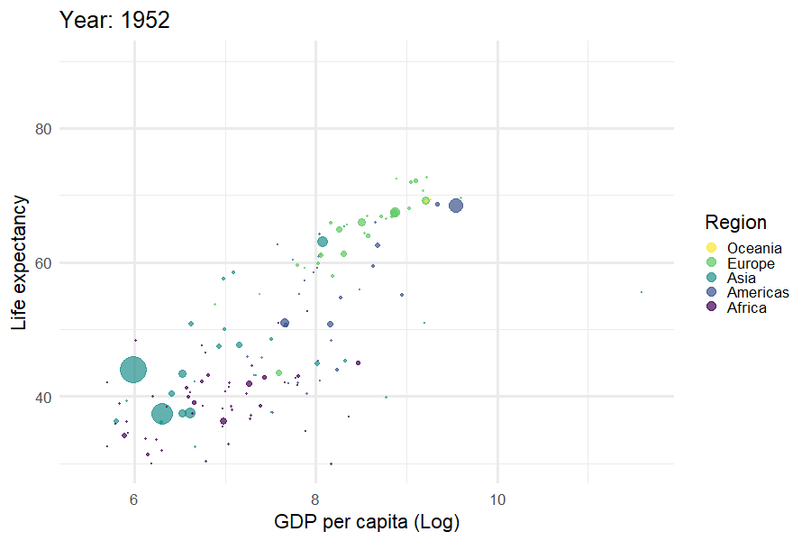
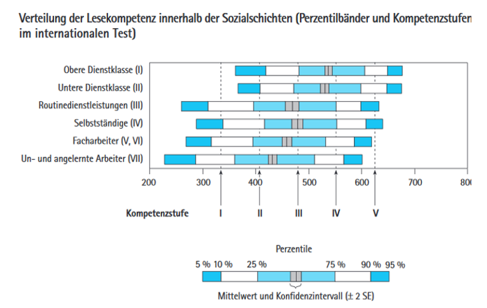
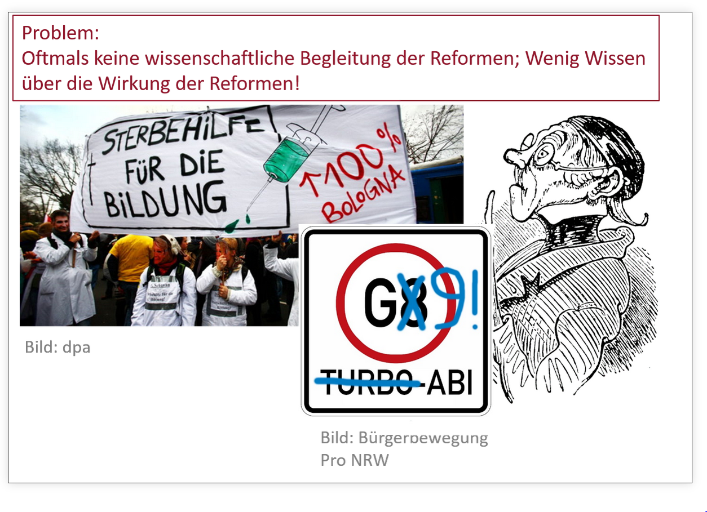

```{r setup, include=FALSE}
options(htmltools.dir.version = FALSE)

library(ggplot2)
library(tidyverse)
#library(HistData)
#library(titanic)
#library(broom)
library(tidyverse)
library(readr)
library(gridExtra)
library(cowplot)
#library(jtools)


knitr::opts_chunk$set(fig.retina = 3, warning = FALSE, message = FALSE)

#setwd("C:/Users/gu99mywo/Dropbox/Lehre/Bildung/Vorlesung Bildung EF/SoSe2021/Folien/05_Soziale_HK_F")

#Simulation Shoe size


```

```{css, echo=FALSE}
/* custom.css */
.left-code {
  color: #777;
  width: 38%;
  height: 92%;
  float: left;
}
.right-plot {
  width: 60%;
  float: right;
  padding-left: 1%;
}
.plot-callout {
  height: 225px;
  width: 450px;
  bottom: 5%;
  right: 5%;
  position: absolute;
  padding: 0px;
  z-index: 100;
}
.plot-callout img {
  width: 100%;
  border: 4px solid #23373B;
}

```


```{r best-features, echo=FALSE}
#search
xaringanExtra::use_search(show_icon = TRUE, position = "top-right")

xaringanExtra::style_search(match_background = "black",
                            input_background = "white",
                            input_border = "black",
                            match_current_background = "green")

xaringanExtra::use_tachyons()
xaringanExtra::use_tile_view()
xaringanExtra::use_webcam()

```


```{r xaringan-themer, include=FALSE, warning=FALSE, eval=TRUE}
library(xaringanthemer)

style_mono_accent(base_color = "#003049",
                  inverse_background_color = "#003049", # dark dark blue
                  inverse_header_color = "#31b09e",     # light aqua green
                  inverse_text_color = "#FFFFFF",       # white
                  title_slide_background_color = "var(--base)",
                  code_font_google = google_font("IBM Plex Mono"),
                  text_font_google = google_font("Lato"),
                  header_font_google = google_font("Lato"))


colors = c(
  red = "#f34213",
  purple = "#3e2f5b",
  orange = "#ff8811",
  green = "#136f63",
  blue = "#002B36",
  white = "#FFFFFF"
)

```


##  Agenda

####  Effekt der soziale Herkunft auf Bildungschancen

- Der typische Forschungsgegenstand der empirischen Bildungsforschung
- Ziele der empirischen Bildungsforschung: (1) Beschreibung, (2) Erklärung und (3) Evaluation/Prognose 


#### Überblick über weitere typische "Forschungsgegenstände":

- Geschlecht und Bildungserfolg
- Übergewicht und Bildungserfolg
- Ausblick Institutionelle Merkmale


---
class: top, center

##  Vorlesung: Empirische Bildungsforschung 


[https://edgar-treischl.de/projects](https://edgar-treischl.de/projects)


---

## Soziale Herkunft und Bildung

#### Der Bildungstrichter:
<center>
</center>


➡️ Wie kommt es zu Unterschieden in der Bildungsnachfrage?


---
## Wirkung von Bildung

<center>
</center>

.bg-ghostwhite.b--dark-red.ba.bw2.br1.shadow-5.ph4.mt1[
Die soziale Herkunft hat einen Einfluss auf Lebenschancen aufgrund der monetären Erträge der Bildung.]

---
## Wirkung von Bildung




---
## Wirkung von Bildung

```{r, echo=FALSE, fig.width=14}
df <- tribble(
  ~outcome, ~sex, ~bildung, ~prozent,
  "Rauchen", "Männer", "Hoch", 25,
  "Rauchen", "Frauen", "Hoch", 21,
  "Rauchen", "Männer", "Mittel", 40,
  "Rauchen", "Frauen", "Mittel", 31,
  "Rauchen", "Männer", "Niedrig", 43,
  "Rauchen", "Frauen", "Niedrig", 35,
  "Bewegungsmangel", "Männer", "Hoch", 19,
  "Bewegungsmangel", "Frauen", "Hoch", 19,
  "Bewegungsmangel", "Männer", "Mittel", 35,
  "Bewegungsmangel", "Frauen", "Mittel", 29,
  "Bewegungsmangel", "Männer", "Niedrig", 34,
  "Bewegungsmangel", "Frauen", "Niedrig", 39,
  "Gesundheit", "Männer", "Hoch", 14,
  "Gesundheit", "Frauen", "Hoch", 16,
  "Gesundheit", "Männer", "Mittel", 25,
  "Gesundheit", "Frauen", "Mittel", 24,
  "Gesundheit", "Männer", "Niedrig", 32,
  "Gesundheit", "Frauen", "Niedrig", 37
)


df$bildung <-  fct_relevel(df$bildung, c("Niedrig", "Mittel", "Hoch"))

p <- ggplot(df, aes(x= bildung, y=prozent, fill = sex))+
  geom_bar(stat = "identity", position="dodge2")+
  theme_minimal(base_size = 22)+
  scale_fill_manual(values=c("#2166ac", "#b2182b"))+
  labs(fill = "Geschlecht")+
  xlab("Bildung") + 
  ylab("Prozent")+
  facet_wrap( ~ outcome)+
  theme(legend.position="bottom")+
  theme(strip.text.x = element_text(size = 22, 
                                    color = "black", 
                                    face = "bold"))
  
p
```

.bg-ghostwhite.b--dark-red.ba.bw2.br1.shadow-5.ph4.mt1[
Die soziale Herkunft hat einen Einfluss auf Lebenschancen durch *nicht-monetäre* Erträge der Bildung.
]


---
## Ziele der Bildungssoziologie

Nach Becker (2011) gibt es drei Ziele:

### ✍️ Beschreibung: 

Beschreibung und differenzierte Analysen von gesellschaftlichen Verhältnissen

### 💡 Erklärung: 
Erklärung gesellschaftlicher Phänomene über systematische Theorie- und Modellbildung

### 🔑 Evaluation und Prognose: 
Systematische Bewertung und Prognose  (z. B. *kausale Wirkung von Interventionen und Bildungsreformen*)


---
class: middle, center

# ✍️ Beschreibung


---

## Im Zeitverlauf

<center>
</center>


---

## Im Zeitverlauf

<center>
</center>

---

## Outcome: Kompetenzen (PISA)

<center>
</center>

.bg-ghostwhite.b--dark-red.ba.bw2.br1.shadow-5.ph4.mt1[ Die soziale Herkunft
hat einen Einfluss auf kognitive Kompetenzen der SuS.]


---

## Outcome: Abschlüsse

<center>
</center>


---
class: middle, center

# 💡 Erklärungsansätze der Bildungssoziologie


---

## Theorien im Überblick

### Die Anfänge
- Die schichtspezifische Sozialisationsforschung

### Klassiker der Bildungssoziologie
- Humankapitaltheorie
- Boudon: Primäre und sekundäre Effekte der Schichtzugehörigkeit

### Moderne Rational Choice (RC) Ansätze


---
class: middle, top

## Die schichtspezifische Sozialisationsforschung

### Zirkelhypothese I


.left[<p style="font-size:110%;">“Die .green[Sozialisation] durch den Beruf prägt in der Regel bei Mitgliedern der sozialen .green[Unterschicht] andere Züge des .green[Sozialcharakters] als bei Mitgliedern der .green[Mittel- und  Oberschicht]; während der Sozialisation durch die Familie werden normalerweise die jeweils typischen Charakterzüge der Eltern an die Kinder weitervermittelt (...)“ (Rolff 1997: 34)” </p> ]


---
class: middle, top

### Zirkelhypothese II

<p style="font-size:110%;">“Da die Sozialisation durch die Schule auf die Ausprägungen des Sozialcharakters der Mittel- und Oberschicht besser eingestellt ist als auf die der Unterschicht, haben es die Kinder aus der Unterschicht besonders schwer, einen guten Schulerfolg zu erreichen. Sie erlangen häufig nur Qualifikationen für die gleichen niederen Berufspositionen, die ihre Eltern bereits ausüben. Wenn sie in diese Berufspositionen eintreten, dann ist der .green[Zirkel] geschlossen.“ (Rolff 1997: 34)</p> 


--

.bg-ghostwhite.b--dark-red.ba.bw2.br1.shadow-5.ph4.mt1[
Problem: Deterministische Zusammenhänge treten empirisch nicht „zwangsweise“ oder gar „immer“ auf.]


---

## Weitere Probleme

- Probabilismus (zu X %) vs. Determinismus (Wenn X, dann Y) in der intergenerationalen „Vererbung von Bildungschancen“

- Kein überzeugender empirischer Nachweis eines Kausalzusammenhangs zwischen schichtspezifischen Lebensbedingungen und der Entwicklung kognitiver Fähigkeiten

- Gibt es heute noch drei (!) Schichten oder Klassen?

- Keine verallgemeinerbare Sozialisationstheorie

- **Verdienst**: Etablierung von "Bildungsungleichheiten“ als Forschungsgegenstand in der Soziologie


---
background-image: url("images/yesno.gif")
background-size: cover
class: bottom, center


### .white[Bildungsentscheidungen sind (häufig) Abwägungsprozesse, wir müssen die Entscheidungen erklären können.] 


---

## Klassiker: Humankapitaltheorie

- Nach Becker 1993, Mincer 1962, Schultz 1961;

- Personen vergleichen das gesamte Lebenseinkommen mit dem Lebenseinkommen, das resultiert, wenn auf die nächste Bildungsstufe verzichtet wird

- .green[Investion in Humankapital]: Wenn das zusätzliche Einkommen (unter Berücksichtigung der Kosten) das alternative Lebenseinkommen ohne Bildungsinvestition übersteigt

- Unterschiede in der Bildungsnachfrage & den Investition von verschieden Bevölkerungsgruppen werden anhand der .green[Verteilung von Opportunitäten & schulischen Erfolg (Wahrscheinlichkeit)] erklärt


---

## Klassiker: Boudon


.left[### Primärer Effekt der Schichtzugehörigkeit:
- Annahme: Es gibt .green[schichtspezifische Unterschiede im kulturellen Hintergrund] mit Auswirkungen auf die schulische Leistungen. Kinder unterscheiden sich bereits vor Beginn der Schulkarriere hinsichtlich akademischer Fähigkeiten.]

.left[### Sekundärer Effekt der Schichtzugehörigkeit: 
- Auch bei .green[gleicher Leistung] hat die soziale Herkunft einen Einfluss im .green[Entscheidungsprozess] der einzelnen Bildungsübergänge.
]


---
## Der primäre und sekundäre Effekt


(Nach: Heckman 2006)

---
background-image: url("images/color_people.gif")
background-size: cover
class: bottom, center

### .red[Ungleichheit ist nicht gleich Ungerechtigkeit (Diskriminierung)] 


---

## Beschreibung

<center>
</center>


---
## Beschreibung

<center>
</center>


---
## Moderne RC-Varianten

### Ungleichheit in der Bildungsbeteiligung werden über die Unterschiede in den antizipierten Kosten und Nutzen der Bildung erklärt

1. Der erreichte oder angestrebte Bildungsabschluss wird .green[in Relation zur sozialen Herkunft interpretiert] („soziale Distanz“ führt zu Unterschieden in den Bildungsaspirationen)

2. Unterschiede in den bewerteten Bildungserträgen (Gefahr des Statusverlustes)

3. Unterschiede in den Opportunitätskosten

➡️  Kosten/Nutzen .green[variieren je nach Position im Statussystem]


---
class: middle, center

# 🔑 Prognose und Evaluation


---
## Evaluationsparadigma




---
## Evaluationsparadigma

- Im alltagssprachlichen Sinne ist mit einer Evaluation jedwede Form der mehr oder weniger systematischen Beurteilung gemeint

### Wissenschaftliche Evaluation

- Systematische Sammlung empirischer Evidenzen
- Systematik und präzise Dokumentation
- Intersubjektive Nachprüfbarkeit
- Identifikation von Ursache und Wirkung


---
## Experimentelle Forschung

### ➡️ Fokus auf Ursache und Wirkung

- Zufallsbedingte Aufteilung .green[(Randomisierung)] auf .green[Kontrollgruppe] (kein Stimulus) und .green[Versuchsgruppe] (Treatment/Stimulus)

- Randomisierung und Stimulussetzung ermöglich die Identifikation von Ursache und Wirkung

- Zufällige Aufteilung und eine hinreichend große Fallzahl ermöglicht die Vergleichbarkeit der Gruppen (kontrolliert für alle Drittvariablen)


---
## Experimentelle Forschung

### Häufige Bedenken von Stakeholdern:

1. Experimente sind nicht ethisch vertretbar.
2. Experimente sind nicht praktisch umsetzbar.
3. Experimente sind künstlich.
4. Experimente basieren auf einer zu geringen Fallzahl und nicht "repräsentativen Daten".

### Zum Teil nicht zutreffend, weil:

1. Ethikboard müssen Verstöße gegen ethische Einwände einlegen.
2. Experimente sind auch in der Bildungsforschung pracktisch umsetzbar.
3. Künstlichkeit betrifft in erster Instanz Laborexperimente.
4. Geringe Fallzahl ist kein allgemeines Problem experimenteller Forschung.


➡️ Bildungsforschung braucht das Zusammenspiel von Umfragen & Experimente

---
## Umfrage und Experimente

### Beschreibung/deskriptive Fragen:

- Der .green[Rückschluss] von einer Stichprobe auf eine Grundgesamtheit bedarf einer systematischen Stichprobenziehung. Beispiel: Wie viele Jugendliche mit niedriger sozialer Herkunft studieren?

- Hierfür wird die .green[Stichprobenziehung] benötigt (häufig als repräsentative Daten bezeichnet)

###Erklärung/kausale Fragen:

- Prinzipiell ist keine Stichprobenziehung erforderlich, solange kein Rückschluss auf Grundgesamt erfolgen soll
- Zusammenhangshypothese: Haben Informationsdefizite (X) einen kausalen Effekt auf Bildungsentscheidungen (Y) von Personen?

- Vielmehr sollten mögliche .green[Störfaktoren] zur Identifikation des kausalen Effekts eliminiert werden (z.B. durch die Randomisierung)


---
## Rückbezug sozialer Herkunftseffekt

#### Ehlert et al. 2017: Feldexperiment zur Evaluation der Informationsdezite:

- Erklärt geringeres Wissen über Finanzierungsmöglichkeiten tertitärer Bildung den sozialen Herkunftseffekt?

- Kostensensibilität von Personen mit niedriger sozialer Herkunft: Mehr Aufklärung über Bildungsrenditen?

- Erklärt das Unterschätzen möglicher Erträge und das Überschätzen von Kosten eine sozial selektive Bildungsteilnahme?


- .green[Treatment]: 25-minütige Infoveranstaltung ein Jahr vor dem Schulabschluss; .green[Kontrollgruppe]: Infomaterial


---
## Ergebnisse (Ehlert et al. 2017)


.bg-ghostwhite.b--dark-red.ba.bw2.br1.shadow-5.ph1.mt1[
Im Treatment steigt die Intention und die Anzahl an Bewerbungen für einen Studienplatz signifikant an für SuS, die keine/ein Elternteil mit Hochschulabschluss haben.]


---
### Zwischenfazit


- Welche Handlungsempfehlungen lassen sich ableiten?

- Rechtfertigt der Effekt der Maßnahme die Kosten der Maßnahme?

- Ist der Kausalschluss gewährleistet (Ursache und Wirkung identifiziert?)

- Wie groß sind Informationsdefizite in der Grundgesamtheit und welchen Effekt könnte der Abbau bewirken?


---
class: middle, center

## Geschlecht


---
### Frauen in der Bildungsforschung

- Seit dem Ende des 19. Jahrhunderts wurde an deutschen Universitäten allmählich die Immatrikulation von Frauen erlaubt 
- Bis weit in die Mitte des 20. Jahrhunderts hatten Mädchen und Frauen nicht die gleichen Bildungschancen wie Männer
- Dies hat ein .green[idealtypisches Bild] geprägt: Besonders benachteiligt waren katholische Arbeitermädchen vom Land

### Aus heutiger Sicht sind Frauen als Bildungsgewinner zu bezeichnen:

- Als „Bildungsverlierer“ (idealtypisches Bild) gelten heute hingegen Jungs mit Migrationshintergrund
- Frauen haben die Jungs bei den Bildungsabschlüssen "überflügelt“
- Dies zeigt sich nicht nur (!) beim Hochschulzugang


---
## Gender ratios

<iframe src="https://ourworldindata.org/grapher/gender-ratios-for-mean-years-of-schooling" loading="lazy" style="width: 100%; height: 450px; border: 0px none;"></iframe>


---
## Studierende


---
background-image: url("images/girls_power.gif")
background-size: cover
class: bottom, center, inverse

## .white[ Sorry, boys! :-) ] 


---
class: middle, center

### Wie bezahlt machen sich die Bildungsabschlüsse der Frauen in Deutschland? 

### Karriere in der ...

### - Wissenschaft?
### - Politik?
### - Wirtschaft?


---
## Frauen in der Wissenschaft

```{r, echo=FALSE, fig.width=12}
library(readxl)
leaky_pipeline <- read_excel("leaky_pipeline.xlsx")
leaky_pipeline$Gruppe <- factor(leaky_pipeline$Gruppe, 
                                levels = c("Studienanfänger", "Studierende", 
                                           "Absolventen", "Promotionen", 
                                           "Habilitationen", "C4-Professoren"))

palette <- c("#29303B", "#0057AD", "#C69472", "#8A8FA1", "#C70C0B")


ggplot(leaky_pipeline, aes(x=Gruppe, y=`2019`, group = Sex, color = Sex)) +
  geom_line(size = 1) +
  geom_point(size = 2)+
  theme_minimal(base_size = 20)+
  geom_label(data = leaky_pipeline %>% filter(Gruppe == "Habilitationen"),
             aes(label = Sex, color = Sex),
             fontface = "bold",
             size = 6)+
  labs(caption = "Daten: destatis.de",
       y = "Anteile nach akademischer Laufbahn (2019)")+
  theme(legend.position="none")+
  scale_color_manual(values = palette)
```


---
## Frauen in der Politik


---
## Frauen in der Wirtschaft


---
## Ursache für geringeres Einkommen

#### Beispiel Fachwahl 🎓 


---
## Ursache für geringeres Einkommen


⚡ Geschlechtsspezifische Fachwahl ist nur eine Ursache für Gender Pay Gap


---
## Zwischenfazit


- Wandel und (Erhalt) eines sozialen „Stratifikationsmusters“

- Ungleichheiten zugunsten der Frauen und sozialer Wandel: Arbeitermädchen vom Lande existiert schon lange nicht mehr

- Konstanz: Auswahl von Studiengängen, „Leaky Pipeline“ in der Hochschule (Erwerbsleben)

➡️ Sozialer Wandel: Jungen als "Bildungsverlierer"?


---
## Männer in der Bildungsforschung

### Jungs als Bildungsverlierer, einige Unterschiede:
- Bessere Test-Score in der Mathematik (PISA)

- Jungen zeigen häufiger Verhaltensauffälligkeiten als Mädchen: „antisoziales“ Verhalten, ADS

- Geschlechtsspezifische Unterschiede in der Einschulung und Klassenwiederholung

- Doppelt so viele Jungen wie Mädchen werden in eine Förderschule eingeschult (Bildungsbericht 2018)


---
## Ursachenforschung

### Einige Schlaglichter:

- Hadjar & Lupatsch 2011: Geschlechtsspezifische Unterschiede hinsichtlich der intrinsischen Motivation, eine negative Schuleinstellung und eine geringe Aufgabenorientierung bei Jungen

- Es gibt geschlechtsspezifische Unterschiede in den außerschulischen Lernwelten (Lesen vs. Computerspiele; Shell Jugend Studien)

- Soziale Anerkennung schulischer Aktivitäten durch die Peer Group (und peer socioeconomic composition, Legewie & DiPrete 2012) 


---
class: middle, center

## Übergewicht und Adipositas

---
### Übergewicht und Adipositas

<iframe src="https://ourworldindata.org/grapher/share-of-adults-who-are-overweight" loading="lazy" style="width: 100%; height: 450px; border: 0px none;"></iframe>


---
### Übergewicht und Adipositas


---
### Bisherige Forschungsergebnisse

- Adipöse Kinder haben eine schlechtere Mathematiknote als normalgewichtige Peers (gegenteilige Befunde: Deutsch)

- Einfluss auf Übergänge: Adipöse Kinder haben eine geringere Wahrscheinlichkeit für den Gymnasialübergang
- Persönlichkeitsmerkmale (Fernsehkonsum, Sport) kann Effekt auf Schulleistung nicht erklären

- Übergewichtseffekt ist bei Mädchen auf u.a. auf Stigma (Hänseln, Selbstwert) zurückzuführen


---
### Beispiel: Stigma/Mobbing

- Deuschle und Sonnberger 2011: Lassen Abbildungen von Kinder (Comics) durch Kinder und Jugendliche bewerten (Ranking)

- Abbildungen: Kind, dunkelhäutiges Kind, Kind im Rollstuhl, übergewichtiges Kind

- Bewertungskriterien: Nettigkeit, Intelligenz, Faulheit, Schönheit und „Spielkameraden-Präferenz“


---
### Beispiel: Stigma/Mobbing


---
### Wirkmechanismen


---
class: middle, center
### Ausblick Institutionelle Merkmale


---

### Ganzheitlicher Blick: Mikro


---
### Institutionelle Eingebundenheit: Meso/Makro


.bg-ghostwhite.b--dark-red.ba.bw2.br1.shadow-5.ph1.mt1[
Ausgestaltung des schulischen Systems (Zeitpunkt des Übergangs zur weiterführenden Schule, Klassengröße, etc) kann Einfluss auf soziale Ungleichheit haben.
]

---
background-image: url("images/giphy.gif")
background-size: cover
class: top, center, inverse

### .white[Sprich, das ganze System 😉] 


---
### Hattie: Lernen sichtbar machen


.left[- Hattie liefert eine Synthese von über 800 Meta-Analysen, die auf über 50.000 Studien mit ca. 250 Millionen Lernenden zurückgreifen
- Berichtet werden zudem Effektstärken: Handelt es sich um einen kleinen, mittleren oder starken Effekt? ]


---
### Hattie: Lernen sichtbar machen


- Beispiel: Klassenwiederholung


---
### Fazit

#### Bildungsforschung verfolgt das Ziel, Bildungsungleichheiten präzise zu beschreiben, ursächlich zu erklären und darauf aufbauend Handlungsempfehlungen abzuleiten.

1) Soziale Herkunft 
- Klassische und moderne Ansätze der Rational Choice Theorie
- Abwägungsprozesse von Bildungsentscheidungen
- Kostensensibilität von sozial-schwachen Schülerinnen und Schüler

2) Geschlecht
- Geschlechtsspezifische Verwertbarkeit von Bildungsabschlüsse (z.B. Gender-Pay Gap)
- Jungen gelten als „neue Verlierer des Bildungssystems“ und unterscheiden sich in mehreren Bildungsindikatoren

3) Übergewicht und Adipositas 
- Einfluss auf Übergänge: Adipöse Kinder haben eine geringere Wahrscheinlichkeit hinsichtlich des Gymnasialübergangs
- Intersektionalität = Adipositas \* Soziale Herkunft \* ?


---
class: middle, center

Thank you very much for your attention!

✉️ <a href="mailto:edgar.treischl@fau.de">edgar.treischl@fau.de</a>


---
### Literaturauszug

- Becker, G. S. (1964): Human Capital: A Theoretical and Empirical Analysis, with Special Reference to Education, National Bureau of Economic Research, New York, NY.

- Becker, R. (2011): Bildungssoziologie – Was sie ist, was sie will, was sie kann. In: R. Becker (Hg.): Lehrbuch der Bildungssoziologie, 2. Aufl., Wiesbaden: VS Verlag, S.9-35.

- Ehlert, M., Finger, C.; Rusconi, A.; Solga, H. (2017): "Applying to College. Do Information Deficits Lower the Likelihood of College-eligible Students from Less-Privileged Families to Pursue their College Intentions? - Evidence from a Field Experiment". Social Science Research, Vol. 67, S. 193-212.

- Heckman, J. J. (2006): Skill formation and the economics of investing in disadvantaged children, Science 312(5782), 1900–1902.

- Helbig, M., S. Jähnen (2013): Bildungsbenachteiligt durch Übergewicht: Warum adipöse Kinder in der Schule
schlechter abschneiden. Zeitschrift für Soziologie 42, S.405-323.

- Mincer, J. (1974): Schooling, Experience, and Earnings, National Bureau of Economic Research, New York, NY.
